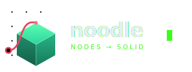

<p align="center">
  
</p>

<h1 align="center">noodle</h1>
<p align="center"><em>nodes → solid</em></p>

A **node-based parametric CAD** app, in the spirit of Grasshopper — visual,
parametric 3D modelling without writing code. (In node editors the wires between
nodes are called *noodles* — so is this.)

You wire nodes in a browser. The backend transpiles the graph to
[build123d](https://build123d.readthedocs.io) Python, runs it in an isolated
worker, and streams back a solid (STL/STEP/…) plus a live mesh preview for the 3D
viewport. Every operation is also exposed over an **MCP server** and a REST API,
so an external AI **coding agent** (Claude Code, Claude Desktop, …) can read and
build the same graphs — in practice the most capable way to drive it today.

> **Status — early beta (v0.1.0).** The modelling engine, ~150 nodes and
> STL / STEP / 3MF / glTF / SVG / DXF export work and are usable today; onboarding
> and polish are still landing. It's **single-user — run it locally.** Feedback
> is very welcome.

<!-- TODO: drop a GIF of the node editor here →  -->
> **New here?** Start the app, open the node editor, and pick one of the bundled
> example projects — **rounded-box**, **flange**, **bolt-flange** — from *Your
> projects*. They seed automatically on the first run.

## Features

- **Visual node graph** with typed wires (geometry / sketch / curve / plane /
  vector / selection / data) and Grasshopper-style **list fan-out**.
- **Parametric primitives & ops**: solids, sketches, booleans, fillet/chamfer,
  shell, loft, sweep, revolve, plus parametric curves → frames → variable loft.
- **Interactive sub-shape selection**: click the edges/faces/vertices you want,
  persisted by geometric signature (survives parameter tweaks).
- **Drive it from an AI coding agent**: an **MCP server** + REST API expose every
  operation (add nodes, wire, set params, execute, export), so Claude Code /
  Claude Desktop or any MCP client can build and edit graphs. This is the most
  robust AI workflow today — see [`AGENTS.md`](AGENTS.md).
- **Experimental in-app copilot**: natural-language → graph over any
  OpenAI-compatible endpoint (local Ollama by default) — handy for quick edits,
  still maturing.
- **Live per-node preview** with a per-node "eye" (auto / on / off).

## Install & run

noodle runs in **Docker**, so it works the same on **Windows, Linux and macOS**.
The only thing to install is Docker itself; the B-Rep kernel (OpenCASCADE) ships
inside the build123d wheel — **nothing to compile**.

### Step 1 — install Docker (once)

- **Windows** → [Docker Desktop](https://docs.docker.com/desktop/install/windows-install/)
  (needs Windows 10/11 + WSL2; the installer enables it). Launch it once and wait
  until it shows **“Running”**.
- **macOS** → [Docker Desktop](https://docs.docker.com/desktop/install/mac-install/).
- **Linux** → [Docker Engine](https://docs.docker.com/engine/install/) (or Docker Desktop).

### Step 2 — get noodle and start it

Download this repository (green **“Code → Download ZIP”** button on GitHub, then
unzip — no git needed), or clone it:

```bash
git clone https://github.com/rederyk/noodle.git
cd noodle
```

Then start it with **one click / one command**:

- **Windows** → double-click **`start.bat`**
- **Linux / macOS** → run **`./start.sh`** (or double-click it)
- **or, any OS, from a terminal** → `docker compose up -d --build`

The first run downloads ~1 GB and takes a few minutes; afterwards it starts in
seconds. The launcher waits until the app is healthy and opens your browser at
the node editor: <http://localhost:8090/nodes> (a read-only build123d code view
of any graph lives at `/ui`).

Stop it any time with `docker compose down`.

> 💡 **No Docker / more advanced?** See [_Develop without Docker_](#develop-without-docker)
> for a host virtualenv. Docker is the supported path for now; a standalone
> desktop app is planned (`DESIGN_APP_SHELL.md`).

### Optional — AI agents & copilot

**Recommended:** drive noodle from an external AI **coding agent** (Claude Code,
Claude Desktop, openclaw…) over **MCP or HTTP** — it's the most capable way to
build graphs. See **[`AGENTS.md`](AGENTS.md)**.

The **in-app copilot** is experimental: copy `.env.example` to `.env` and
configure an OpenAI-compatible provider (or run a local [Ollama](https://ollama.com)
with a tool-capable model).

> ⚠️ **Security**: the engine executes graph code (including `CodeBlock` /
> `Expression` nodes) as **arbitrary Python in a subprocess** and is **not yet
> sandboxed**. Run it **single-user / locally / trusted only** — do **not** expose
> the port to an untrusted network. Sandboxing is tracked as item **D3** in
> `PLAN_NODE_CAD.md`. The container does run as a **non-root user (uid 1000)**
> and project names are validated server-side (no path traversal).
>
> **Upgrading from an older (root) image**: projects written by it are root-owned
> on the host; fix once with `sudo chown -R 1000:1000 projects feedback`.

## Develop without Docker

A host virtualenv with build123d lets you transpile and execute graphs directly —
the fastest way to verify an engine change:

```bash
python -m venv .venv-b123d
.venv-b123d/bin/pip install -r requirements.txt
# transpile + run a saved graph headless (see CLAUDE.md §2 for the snippet)
```

Backend Python lives in `cad_nodes/`; the editor is `webui/nodes.html`; the API
is `server.py`. See **`CLAUDE.md`** for the full architecture map and the rules
for adding nodes, and **`PLAN_NODE_CAD.md`** for the design doc + roadmap.

## Tests

```bash
python -m pytest tests/ -v   # pure-Python: toposort, validation, transpiler, api
```

## License

**MIT** — see [`LICENSE`](LICENSE).

This project builds on third-party components with their own licenses, most
notably **OpenCASCADE / OCCT (LGPL-2.1)** via build123d. Because it is used as a
dynamically-linked library, it does not change noodle's MIT license. See
[`THIRD_PARTY_NOTICES.md`](THIRD_PARTY_NOTICES.md) for the full map and the LGPL
compliance note.
